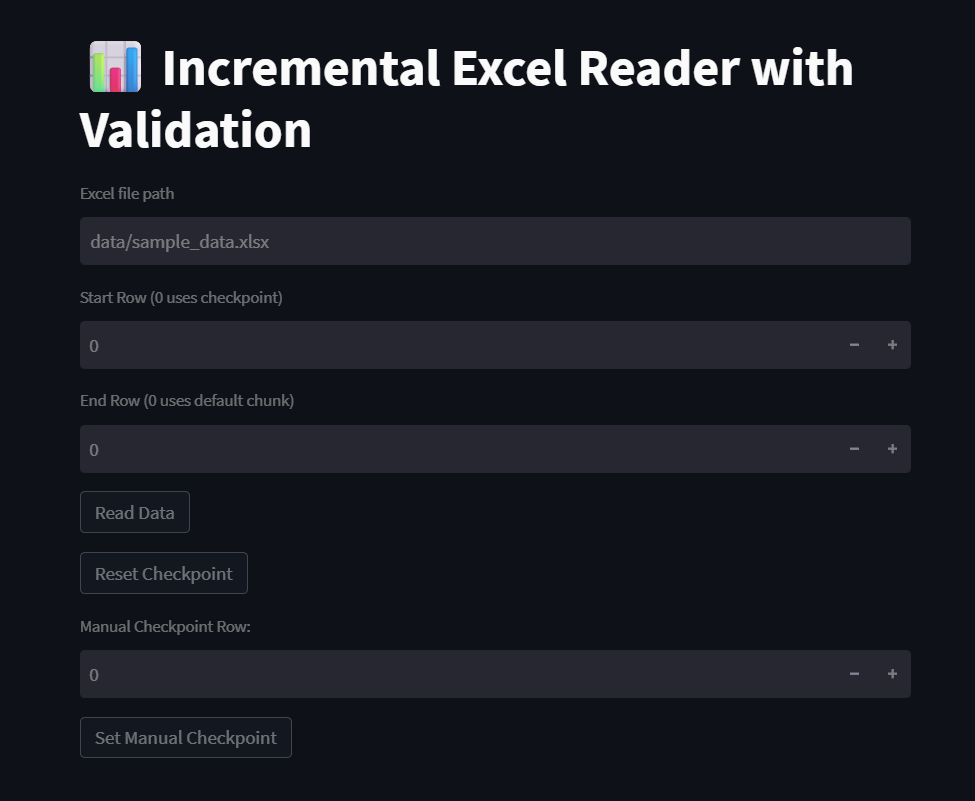

# 📈 Incremental Excel Data Reader

A Python-based project that reads data incrementally from Excel files without using a database. It uses a local checkpointing mechanism to track previously read rows and offers a Streamlit-based UI for manual or automatic data loading.

**Designed for scenarios where data is stored in `.xlsx` format and grows over time, this tool ensures only new records are processed each time.**

---

## 🖼️ UI Screenshot



## 🚀 Features

- ✅ **Incremental data loading** - remembers the last read row and resumes from there
- 📁 **Excel file as data source** - no database required
- 🖱️ **Streamlit UI** - trigger and visualize data loading
- ⚙️ **Checkpoint management** - editable JSON-based tracking
- 🧪 **Unit test support** - comprehensive testing with `pytest`
- 🛠️ **Modular code structure** - easy extension and maintenance

---

## 📁 Project Structure

```
BP_Task/
├── append_sample_data.py     # Script to simulate new records
├── create_sample_data.py     # Script to generate initial sample data
├── main.py                   # Optional entry point to run data logic
├── requirements.txt          # Python dependencies
├── README.md                 # Project documentation
│
├── checkpoint/
│   └── last_read.json        # Stores checkpoint (last read row)
│
├── data/
│   └── sample_data.xlsx      # Excel data file to be read
│
├── src/                      # Core logic modules
│   ├── __init__.py
│   ├── checkpoint_manager.py # Handles saving/loading checkpoints
│   ├── config.py            # Configuration values
│   ├── reader.py            # Excel reading logic
│   └── validator.py         # Optional: Data validation functions
│
├── tests/                   # Unit tests
│   ├── __init__.py
│   └── test_reader.py       # Tests for reading logic
│
├── ui/
│   └── app.py              # Streamlit UI app
│
└── venv/                   # Virtual environment (ignored by Git)
```

---

## 🧰 Getting Started

### 1. Clone the repository

```bash
git clone <your-repo-url>
cd BP_Task
```

### 2. Set up the virtual environment

```bash
python -m venv venv
```

**Activate the environment:**

```bash
# On Windows:
venv\Scripts\activate

# On macOS/Linux:
source venv/bin/activate
```

### 3. Install the required dependencies

```bash
pip install -r requirements.txt
```

---

## 🏃 Running the Project

### Step 1: Create sample data

```bash
python create_sample_data.py
```

### Step 2: Append new data (simulate daily new entries)

```bash
python append_sample_data.py
```

### Step 3: Launch the Streamlit UI

```bash
python -m streamlit run ui/app.py
```

### Step 4: Use the application

1. Click the **"Load Data"** button to load new records from the Excel file
2. The checkpoint is automatically updated after each run
3. To restart from a specific record, manually edit `checkpoint/last_read.json`

---

## ⚙️ Configuration

Basic config settings are defined in `src/config.py`. You can adjust:

- 📂 **Excel file path**
- 📊 **Chunk size**
- 📋 **Sheet name** (if needed)
- ✅ **Column validation rules** (via `validator.py`)

---

## 📌 Notes

- 🚫 **No external database** is used — checkpoint is managed through a JSON file
- 🎯 **Ideal for ETL prototyping**, internal data utilities, or when DB access is restricted
- 🔧 **Easily extendable** to support `.csv`, APIs, or databases

---

## 🤝 Contributing

Pull requests are welcome! Consider contributing in areas like:

- 📄 Adding `.csv` or API support
- 🎨 Improved UI controls (date filters, preview rows)
- ✨ Enhanced validation or reporting features
